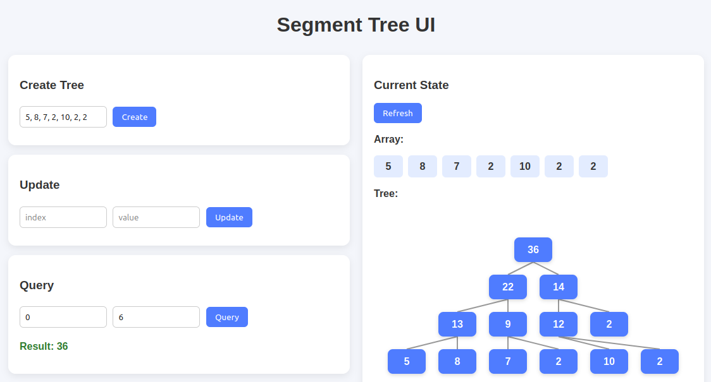

# Segment Tree 

## Usage

* Run Backend
```
cd backend
cargo run
```

* Run Frontend
```
npm install -g serve
cd frontend
serve
```

* Access page at http://localhost:3000/

* Sample input: `[5, 8, 7, 2, 10, 2, 2]`

